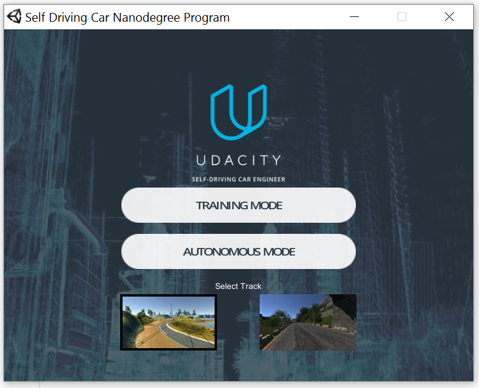
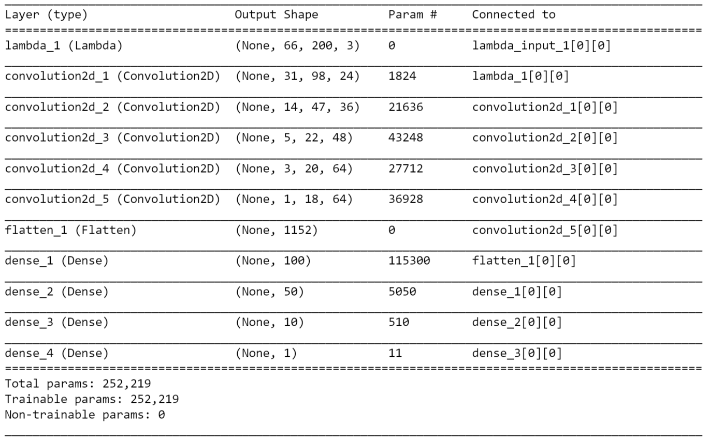
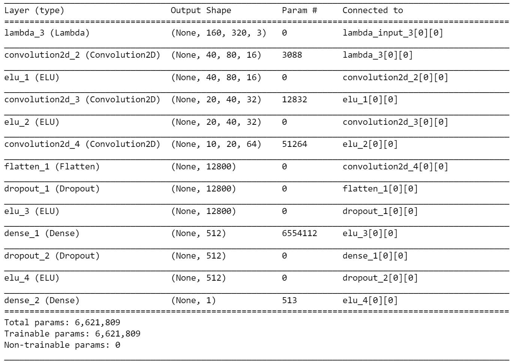
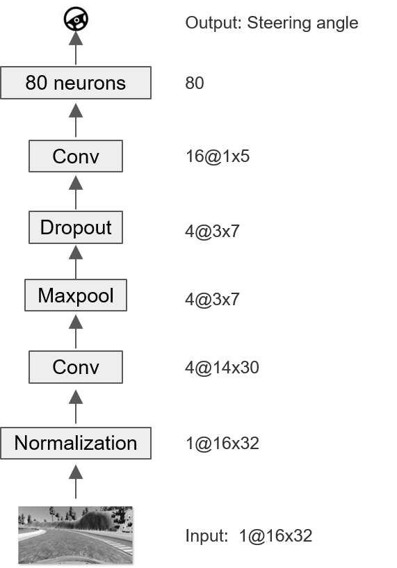

# Self-Driving Car Nanodegree

## Project 3: Behavioral Cloning

### 1. Introduction

This project is to train a CNN model to autonomously drive a car in the simulator using behavioral cloning method. 

The simulator is provided by Udacity, which has two playing modes: training mode and autonomous mode. Training mode is to drive the car by user and collect the driving behavioral data at the same time. Autonomous mode is to autonomously drive the car using the created CNN model and learned parameters.


### 2. Data Collecting & Preprocessing

#### 2.1 Collecting Training Data

The training data can be collected via the simulator in the training mode. Also Udacity provides us a sample data for track 1, which was used in my project.

#### 2.2 Data Pre-processing

The pre-processing steps used in this project are listed below:

* To make the model lightweight and accelerate the training process, the original images were resized from 320x160 to 32x16.

* The color space was converted from RGB to HSV.

* S channel was selected for training.


**Recovery**

Multiple cameras were used to recover the car's direction from being off-center. The images from left and right cameras were appended to the training data, their corresponding steering angles were biased from the original angles, _+delta/-delta_, respectively.

**Save the Data** 
The processed data was saved as 'X.data.npy' and 'y.data.npy' for the future training process.


### 3. Model Architecture Design

In order to build a CNN architecture to realize the autonomous driving, first I studied the NVDIA and Comma.ai models. Both of them have been validated in the real driving situation, so it is believed that they have the ability to drive the car in the simulator as long as we have enough organized data and the models are properly trained. The details of NVDIA and Comma.ai CNN architectures are listed in the following sections 3.1 and 3.2. 

Reviewing these two models, NVIDIA model has _**~252k**_ parameters while Comma.ai has _**~6,622k**_ parameters waiting for optimization. I found that both of them have too many parameters and would be slow for training. Given that the environment in simulator is much simpler than the real environment, I think some lightweight CNN architectures would be powerful enough to finish our goal.

As explained in the previous section, the original image data was resized to 16x32, which is just of the similar complexity with the digits data we played in [Project 2](https://github.com/WenjinTao/Self-Driving-Car-Nanodegree--Udacity/blob/master/Term1/P2-Traffic_Sign_Classifier/Traffic_Sign_Classifier-WenjinTao.ipynb) whose data shape is 32x32. Due to the similarity of their complexities, I decided to build up an architecture that is similar with LeNet used in Project 2. 

As discussed in our classroom, the multilayer CNN trys to capture features and learn the unseen patterns on different levels.

> The first layer is the lowest level in the hierarchy, where the CNN generally classifies small parts of the image into simple shapes like horizontal and vertical lines and simple blobs of colors. The subsequent layers tend to be higher levels in the hierarchy and generally classify more complex ideas like shapes (combinations of lines), and eventually full objects like dogs.

The input data is a 16x32 image, which contains some low-level features like lines and curves, and some higher-level features like curbs and pavements. Therefore, I used  two convolutional layers in my CNN model. The first convolutional layer is to learn the low-level features and second convolutional is to learn the higher-level features. 1 maxpooling and 1 dropout layer were implemented between those two convolutional layers to pick the significant features and avoid overfitting, respectively. The data were normalized before feeding into this model. After the second convolutional layer, the dataflow was flattened to 80 neurons, and followed by a dense layer.

The details of the architecture I used for this project are explained in 3.3. 

#### 3.1 NVIDIA Model

The NVIDIA model can be found at [End-to-End Deep Learning for Self-Driving Cars](https://devblogs.nvidia.com/parallelforall/deep-learning-self-driving-cars/). It was implemented in Keras, which is listed below.

````python
# NVIDIA Model
# Create the Sequential model
model = Sequential()
input_shape = (66, 200, 3)
# Layer Normalization - Add a lambda layer
model.add(Lambda(lambda x: x/127.5 - 1.0, input_shape=input_shape))
# Layer Conv.1
model.add(Conv2D(24, 5, 5,  subsample=(2,2), border_mode='valid',activation='relu'))
# Layer Conv.2
model.add(Conv2D(36, 5, 5, subsample=(2,2), border_mode='valid',activation='relu'))
# Layer Conv.3
model.add(Conv2D(48, 5, 5, subsample=(2,2), border_mode='valid',activation='relu'))
# Layer Conv.4
model.add(Conv2D(64, 3, 3, border_mode='valid',activation='relu'))
# Layer Conv.5
model.add(Conv2D(64, 3, 3, border_mode='valid',activation='relu'))
# Layer Flatten - Add a flatten layer
model.add(Flatten())
model.add(Dense(100, activation='relu'))
model.add(Dense(50, activation='relu'))
model.add(Dense(10, activation='relu'))
model.add(Dense(1))
````
**Model.summary:**



#### 3.2 Comma.ai Model

The Comma.ai model can be found at [train_steering_model ](https://github.com/commaai/research/blob/master/train_steering_model.py).  

````python
# Comma.ai model
model = Sequential()
input_shape = (160, 320, 3)
model.add(Lambda(lambda x: x/127.5 - 1., input_shape=input_shape))
model.add(Convolution2D(16, 8, 8, subsample=(4, 4), border_mode="same"))
model.add(ELU())
model.add(Convolution2D(32, 5, 5, subsample=(2, 2), border_mode="same"))
model.add(ELU())
model.add(Convolution2D(64, 5, 5, subsample=(2, 2), border_mode="same"))
model.add(Flatten())
model.add(Dropout(.2))
model.add(ELU())
model.add(Dense(512))
model.add(Dropout(.5))
model.add(ELU())
model.add(Dense(1))
````

**Model.summary:**



#### 3.3 Model Used in this Project

The model I used in this project has a relatively lightweight architecture. As shown in the following figure, it has 7 layers which are listed below as well:




1. Normalization layer
2. 1st Convolutional layer
3. Maxpooling layer
4. Dropout layer
5. 2nd Convolutional layer
6. Flatten layer
7. Dense layer with the steering angle output

````python
# CNN model
model = Sequential()
input_shape = (16, 32, 1)
model.add(Lambda(lambda x: x/127.5 - 1.0, input_shape=input_shape))
model.add(Conv2D(4, 3, 3, border_mode='valid', activation='relu'))
model.add(MaxPooling2D(pool_size=(4,4)))
model.add(Dropout(0.25))
model.add(Conv2D(16, 3, 3))
model.add(Flatten())
model.add(Dense(1))
````
**model.summary:**

| Layer (type)                    | Output Shape      | Param # | Connected to          |
| ------------------------------- | ----------------- | ------- | --------------------- |
| lambda_1 (Lambda)               | (None, 16, 32, 1) | 0       | lambda_input_1[0][0]  |
| convolution2d_1 (Convolution2D) | (None, 14, 30, 4) | 40      | lambda_1[0][0]        |
| maxpooling2d_1 (MaxPooling2D)   | (None, 3, 7, 4)   | 0       | convolution2d_1[0][0] |
| dropout_1 (Dropout)             | (None, 3, 7, 4)   | 0       | maxpooling2d_1[0][0]  |
| convolution2d_2 (Convolution2D) | (None, 1, 5, 16)  | 592     | dropout_1[0][0]       |
| flatten_1 (Flatten)             | (None, 80)        | 0       | convolution2d_2[0][0] |
| dense_1 (Dense)                 | (None, 1)         | 81      | flatten_1[0][0]       |

Total params: 713

Trainable params: 713

Non-trainable params: 0


### 4. Model Training

**Optimizer: AdamOptimizer**

As discussed in [Project 2](https://github.com/WenjinTao/Self-Driving-Car-Nanodegree--Udacity/blob/master/Term1/P2-Traffic_Sign_Classifier/Traffic_Sign_Classifier-WenjinTao.ipynb), the Optimizer is to calculate gradients for a loss function and apply them to different variables of a model. _**Adaptive Moment Estimation (Adam)**_ method allows us to use larger step sizes (learning rates) without fine tuning. It works well in practice and compares favorably to other adaptive learning method algorithms. Then I keep using 'Adam' as the optimizer in this project.

**Batch size**

As explained in [Project 2](https://github.com/WenjinTao/Self-Driving-Car-Nanodegree--Udacity/blob/master/Term1/P2-Traffic_Sign_Classifier/Traffic_Sign_Classifier-WenjinTao.ipynb):

> Batch size determines how many examples you look at before making a weight update. The lower it is, the noisier the training signal is going to be, the higher it is, the longer it will take to compute the gradient for each step.

This time I specified the batch size as _**256**_ instead of 128 used in Project 2 to make the training signal less noisy. After some trial and errors, I also got the acceptable converging results.

**Epochs**

The number of Epochs was chosen from the range of 10~50. After some experiments, _**15**_ was selected because increasing the Epochs times didn't improve the training performance from then, and the evaluation performance on the two tracks was already good enough.

**To summarize**, the model was trained to minimize the mean-squared error using 'adam' optimizer, with a batch size of 256 and epoch of 15. 20% of the data was used for validation.

The code is listed here:

````python
model.compile(optimizer='adam', loss='mean_squared_error')
history = model.fit(X, y, batch_size=256, nb_epoch=15, verbose=1, validation_split=0.2)
````

**Validation & Evaluation**

This model was validated by applying the learned parameters onto the validation dataset. After many experiments, loss~0.025 is an acceptable criterion.

Finally the model was evaluated on both of the tracks in the simulator to check whether the car is able to navigate correctly. The specification is listed here :

> No tire may leave the drivable portion of the track surface. The car may not pop up onto ledges or roll over any surfaces that would otherwise be considered unsafe (if humans were in the vehicle).[(From rubrics)](https://review.udacity.com/#!/rubrics/432/view)

### 5. Summary

The S channel of the HSV color space with image size of 32x16 provides us enough information to train our model. This created CNN model has 1 Lambda layer to normalize the input, 2 convolutional layers to add its depth, 1 maxpooling layer to pick the significant features, 1 dropout layer to avoid overfitting, 1 flatten layer with 1 dense layer to obtain the steering angel value.

After training, this model successfully drove the car on both of the tracks by itself.

### 6. Appendix

#### 6.1 File Structure

````html
+-- data/
|	+-- IMG/
|	|	+-- center_2016_12_01_13_30_48_287.jpg
|	|	...
|	+-- driving_log.csv
+-- X.data.npy - The training data saved from data.py
+-- y.data.npy - The training data saved from data.py
+-- model.py - The script used to create and train the model.
+-- drive.py - The script to drive the car.
+-- model.json - The model architecture saved from Keras.
+-- model.h5 - The model weights saved from Keras.
+-- figures/
|	+-- simulator.PNG
|	...
````


#### 6.2 Videos of Evaluation

Video of the CNN performance on the two tracks can be found here:

Track 1:

[](https://www.youtube.com/watch?v=f8TJ_bV4DKA)

Track 2:

[](https://www.youtube.com/watch?v=VcyPwxqqN5E)


#### 6.3 Requirements

* anaconda

* tensorflow

* keras

* cv2

* To be added if needed...

#### 6.4 Extra Reference

[Practical Recommendations for Gradient-Based Training of Deep Architectures](https://arxiv.org/pdf/1206.5533.pdf)