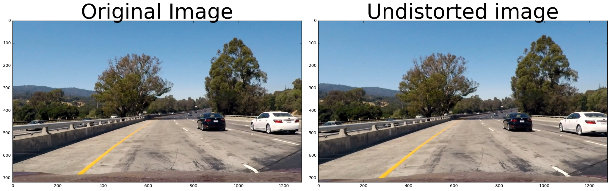
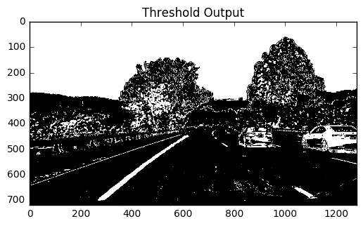
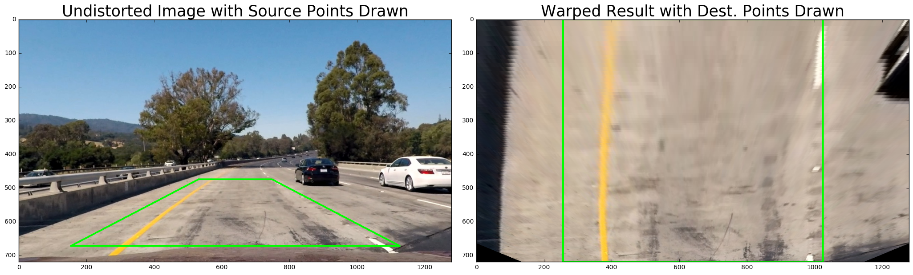
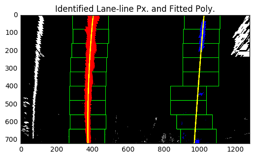

#Advanced Lane Finding
---

## 1. Introduction

The goal of this project is to write a software pipeline to identify the lane boundaries in a video from a front-facing camera on a car. The detailed goals / steps of this project are the following:

1. Compute the camera calibration matrix and distortion coefficients given a set of chessboard images.
2. Apply a distortion correction to raw images.
3. Use color transforms, gradients, etc., to create a thresholded binary image.
4. Apply a perspective transform to rectify binary image ("birds-eye view").
5. Detect lane pixels and fit to find the lane boundary.
6. Determine the curvature of the lane and vehicle position with respect to center.
7. Warp the detected lane boundaries back onto the original image.
8. Output visual display of the lane boundaries and numerical estimation of lane curvature and vehicle position.


## 2. Camera Calibration

The code for this step is contained in the second code cell of the IPython notebook located in "./P4-Advanced_Lane_Finding-Camera_Calibration.ipynb" [here](./P4-Advanced_Lane_Finding-Camera_Calibration).  The camera calibration images are available in "./camera_cal". 

I start by preparing "object points", which will be the (x, y, z) coordinates of the chessboard corners in the world. Here I am assuming the chessboard is fixed on the (x, y) plane at z=0, such that the object points are the same for each calibration image.  Thus, `objp` is just a replicated array of coordinates, and `objpoints` will be appended with a copy of it every time I successfully detect all chessboard corners in a test image.  `imgpoints` will be appended with the (x, y) pixel position of each of the corners in the image plane with each successful chessboard detection.  

I then used the output `objpoints` and `imgpoints` to compute the camera calibration and distortion coefficients using the `cv2.calibrateCamera()` function as shown below. 

```python
ret, mtx, dist, rvecs, tvecs = cv2.calibrateCamera(objpoints,
                                                   imgpoints, 
                                                   img.shape[0:2],
                                                   None, None)
```

 I applied this distortion correction to the test image using the `cv2.undistort()` function listed below and obtained this result as shown in the figures: 

```python
img_undst = cv2.undistort(img, mtx, dist, None, mtx)
```


Then I saved these calibration parameters for future use. The code is listed here,

```python
# Save the calibration parameters
calibration_pickle = {}
calibration_pickle['mtx'] = mtx
calibration_pickle['dist'] = dist
pickle.dump( calibration_pickle, open('./calibration_pickle.p', 'wb') )
```


##3. Pipeline ( Testing on single images)

####3.1 An example of a distortion-corrected image.
To demonstrate this images rectifying step, I applied the distortion correction to one of the test images (./test_images/test1.jpg) as shown below. We can see the slightly difference on the edges of the images.




####3.2 Threshold for Lane Information 

I used a combination of color and gradient thresholds to generate a binary image (thresholding steps at the 4th code cell in `./P4-Advanced_Lane_Finding-Pipelin.ipynb`).  Here's an example of my output for this step.



####3.3 Perspective Transformation

The code for my perspective transform includes two functions called `perspective_transformer()` and  `warper()`, which appear in the  in the 3rd and 5th code cells of "./P4-Advanced_Lane_Finding-Pipeline".  The `warper()` function takes as inputs an image (`img`), as well as source (`src`) and destination (`dst`) points.  The source and destination points are hardcoded in `perspective_transformer()` as follows:

```python
bot_width = .76 # Bottom side of the trapzoid
mid_width = .17 # Top side of the trapzoid
height_pct = .66 # Percent from top of the image to top side of the trapzoid
bottom_trim = .935 # Trim the bottom region to neglect the hood

src = np.float32([
    [img_width*(.5-mid_width/2), img_height*height_pct],
    [img_width*(.5+mid_width/2), img_height*height_pct],
    [img_width*(.5+bot_width/2), img_height*bottom_trim],
    [img_width*(.5-bot_width/2), img_height*bottom_trim]
])

offset = img_width*.2

dst = np.float32([
    [offset, 0],
    [img_width-offset, 0],
    [img_width-offset, img_height],
    [offset, img_height]
])
```

This resulted in the following source and destination points:

|  Source   | Destination |
| :-------: | :---------: |
| 531, 475  |   256, 0    |
| 749, 475  |   1024, 0   |
| 1126, 673 |  1024, 720  |
| 154, 673  |   256, 0    |

I verified that my perspective transform was working as expected by drawing the `src` and `dst` points onto a test image and its warped counterpart to verify that the lines appear parallel in the warped image.



####3.4 Identifying lane-line pixels and fitting a Polynomial

Then I implemented functions `slinding_windows_search()` and `lane_tracking()`, which are contained in the 6th and 7th code cells in `P4-Advanced_Lane_Finding-Pipeline.ipynb`, to detected the lane-line pixels and fit the pixels with a 2nd order polynomial. The example result is shown below, the red ones are detected left lane-line pixels, and the blue ones are detected right lane-line pixels. The fitted polynomial are illustrated as the two yellow curves.



####3.5 Calculating the radius of curvature of the lane and the position of the vehicle with respect to center

I did this using function `cal_curvature()` in the 8th code cell in my code in `P4-Advanced_Lane_Finding-Pipeline.ipynb` to calculate those variables.

####3.6 Result plotted back down onto the road

I implemented this step using function `lane_mask()` in the 9th code cell in my code of `Advanced_Lane_Finding-Pipeline.ipynb` .  Here is an example of my result on a test image:


---

## 4. Pipeline (Video Output)

The video can be found here:

[](https://youtu.be/Dc_axsKVrTQ)

---

##5. Discussion

The wobbly issues need more fine tuning and smoothing techniques, which will be my further direction.  

##6. Appendix

[//]: # "Image References"

[image1]: ./output_images/02.png "Undistorted"
[image2]: ./output_images/03.png "Road Transformed"
[image3]: ./output_images/04.png "Binary Example"
[image4]: ./output_images/05.png "Warp Example"
[image5]: ./output_images/06.png "Fit Visual"
[image6]: ./output_images/01.png "Output"
[video1]: https://youtu.be/Dc_axsKVrTQ "Video"